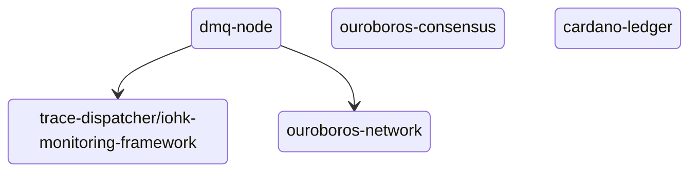

# Decentralized Message Queue

TODO fix these links

The DMQ node allows for client peers to communicate efficiently by publishing
and consuming messages which are diffused over a P2P network to other nodes.

This repository provides the `dmq-node` executable to participate in the DMQ network.

TODO diagram

# Instructions

TODO

# Contributing

The contributing guide is available [here][contributing-guide].
The style guide is available [here][style-guide].
The code of conduct is available [here][code-of-conduct].

# References

[cardano-node]:  https://github.com/intersectmbo/cardano-node
[contributing-guide]: ./CONTRIBUTING.md
[code-of-conduct]: ./CODE_OF_CONDUCT.md
[style-guide]: ./docs/StyleGuide.md
